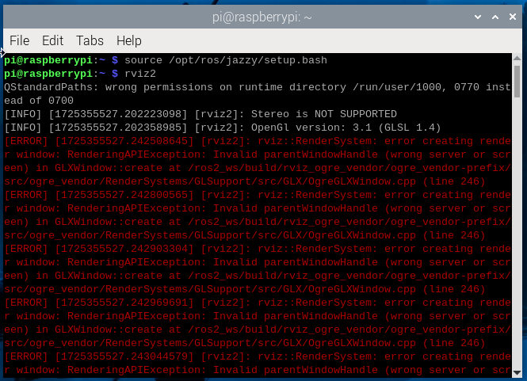

# ros2_publisher

## Dependencies

**Raspberry Pi:**  

> Please refer to the instructions above for _*a. Driver Install*_, _*b. Configuration*_, and _*c. SDK Install*_ which run on Raspberry Pi.  

**Jetson:**  

> Please refer to the instructions above for _*project dependencies*_ and _*SDK Install*_ which run on Jetson.

### ROS2 Installation

#### On Raspberry Pi

Install ROS2 on Raspberry Pi. See [ROS2 Installation](https://docs.ros.org/en/jazzy/Installation/Ubuntu-Install-Debs.html) for details.
Alternatively, you can use a third-party installation script to install ROS2 on Raspberry Pi. See [this repository](https://github.com/Ar-Ray-code/rpi-bullseye-ros2) for details.

#### On Jetson

The example is based on ROS2. Please refer to [ROS2 Installation](https://docs.ros.org/en/jazzy/Installation/Ubuntu-Install-Debs.html) and install it yourself.

```bash
# Install the compilation tool colcon
sudo apt install python3-colcon-common-extensions
```

### ROS2 post-installation

Then export the environment variables to the bashrc file.

-----
> for humble version

```Shell
echo "source /opt/ros/humble/setup.bash" >> ~/.bashrc 
echo "export ROS_DOMAIN_ID=7" >> ~/.bashrc 
source ~/.bashrc 
```

-----
> for jazzy version

```Shell
echo "source /opt/ros/jazzy/setup.bash" >> ~/.bashrc
echo "export ROS_DOMAIN_ID=7" >> ~/.bashrc
source ~/.bashrc
```

## Compilation

```Shell
  cd Arducam_tof_camera/ros2_publisher
  colcon build --merge-install 
```

### Run C++ examples

```Shell
  . install/setup.bash 
  ros2 run arducam_rclcpp_tof_pointcloud tof_pointcloud
```

### Run Python examples

```shell
  . install/setup.bash 
  ros2 run arducam_rclpy_tof_pointcloud tof_pointcloud
```

>You can preview by running rviz2 on the host in the LAN

### RViz2

> If you encounter an error like this:
> 
> Make sure to set the Display Server to X11.

```Shell
  rviz2
```
